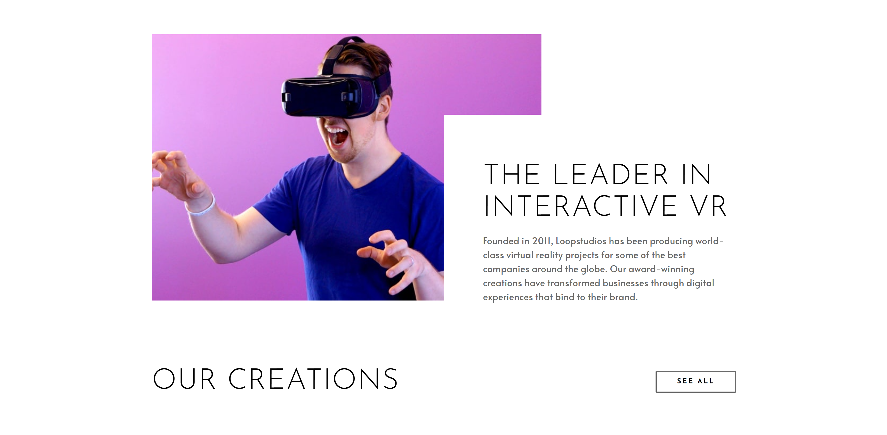
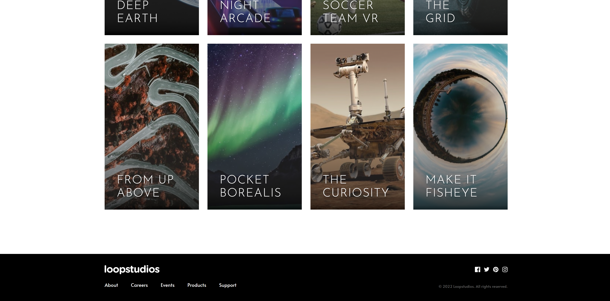

# LoopStudios

A mobile-responsive landing page for a fictional VR company called LoopStudios.

## Link

Visit the landing page here: https://mully7773.github.io/LoopStudios/

## Screenshots

 

 

 

 

## Description

This is a challenge from Frontend Mentor. You can find more information about it [here](https://www.frontendmentor.io/challenges/loopstudios-landing-page-N88J5Onjw).
My task was to make the landing page look and function as close to the original design as possible. I used linear gradients over the gallery images for better text legibility. In addition, I added a nice transition animation to the mobile menu. Note: the simulated mobile layout and design in Chrome Dev Tools differs from the true mobile layout if one were to view the page on a smartphone, for example.

## Functionality

I went pretty light on the interactivity side of things this time. Instead, I focused on the layout and design. My main goal was to become more comfortable creating layouts from scratch. That said, the mobile hamburger menu utilizes a simple animation and different menu style for a better mobile user experience.

## Technology

HTML
 
CSS
 
JavaScript

## Questions:

Feel free to contact me at mully7773@gmail.com if you have any questions.  
You can view more of my projects at https://github.com/Mully7773.
